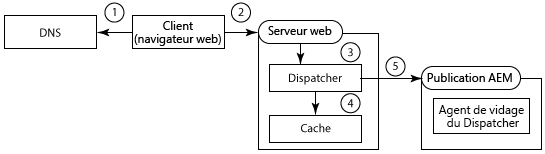
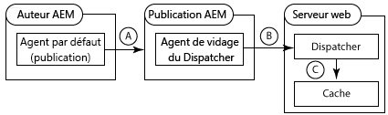
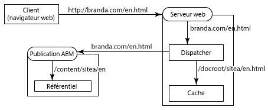
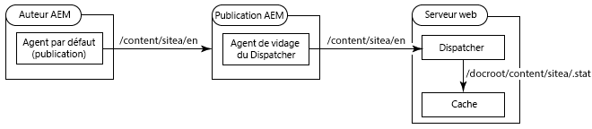
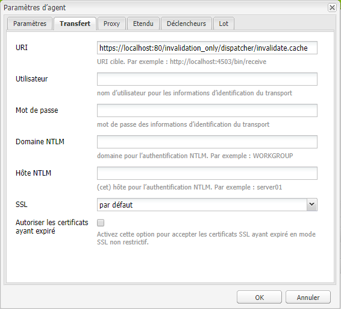
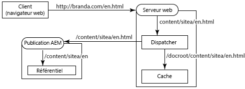
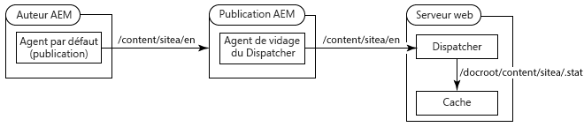
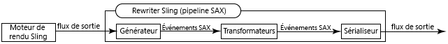
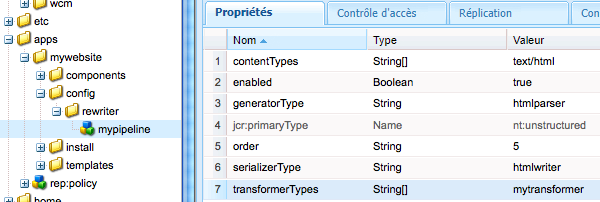

# Utilisation de Dispatcher avec plusieurs domaines {#using-dispatcher-with-multiple-domains}

>[!NOTE]
>
>Les versions de Dispatcher sont indépendantes d’AEM. Vous avez peut-être été redirigé vers cette page si vous avez suivi un lien renvoyant vers la documentation de Dispatcher inséré dans la documentation d’AEM ou de CQ.

Utilisez Dispatcher pour traiter les demandes de page sur plusieurs domaines web tout en respectant les conditions suivantes :

* Le contenu web des deux domaines est stocké dans un référentiel AEM unique.
* Les fichiers du cache de Dispatcher peuvent être invalidés séparément pour chaque domaine.

Par exemple, une entreprise publie des sites web pour deux de leurs marques : Marque A et Marque B. Le contenu des pages du site web est créé dans AEM et stocké sur le même espace de travail du référentiel :

```
/
| - content  
   | - sitea  
       | - content nodes  
   | - siteb  
       | - content nodes
```

Les pages pour `BrandA.com` sont stockées ci-dessous `/content/sitea`. Les requêtes client pour l’URL `https://BrandA.com/en.html` sont renvoyées à la page rendue pour le nœud `/content/sitea/en`. De même, les pages pour `BrandB.com` sont stockées sous `/content/siteb`.

Lorsque Dispatcher est utilisé pour mettre en cache du contenu, des associations doivent être effectuées entre l’URL de la page de la requête HTTP du client, le chemin d’accès au fichier correspondant du cache et le chemin d’accès au fichier correspondant dans le référentiel.

## Demandes clients

Lorsque des clients envoient des requêtes HTTP au serveur web, l’URL de la page demandée doit être résolue sur le contenu du cache de Dispatcher et enfin sur le contenu du référentiel.



1. Le système de noms de domaine (DNS) détecte l’adresse IP du serveur web qui est enregistrée dans le nom de domaine de la requête HTTP.
1. La requête HTTP est envoyée au serveur web.
1. La requête HTTP est transmise à Dispatcher.
1. Dispatcher détermine si les fichiers mis en cache sont valides. S’ils sont valides, les fichiers en cache sont distribués au client.
1. Si les fichiers en cache ne sont pas valides, Dispatcher demande des pages nouvellement rendues à l’instance de publication AEM.

## Invalidation du cache

Lorsque les agents de réplication de purge de Dispatcher demandent que ce dernier invalide les fichiers mis en cache, le chemin d’accès au contenu du référentiel doit se résoudre sur le contenu du cache.



* a - Une page est activée sur l’instance d’auteur AEM et le contenu est répliqué sur l’instance de publication.
* b - L’agent de purge de Dispatcher appelle Dispatcher pour invalider le cache du contenu répliqué.
* c - Dispatcher modifie un ou plusieurs fichiers .stat pour invalider les fichiers mis en cache.

Pour utiliser Dispatcher avec plusieurs domaines, vous devez configurer AEM, Dispatcher et le serveur web. Les solutions décrites dans cette page sont générales et s’appliquent à la plupart des environnements. En raison de la complexité de certaines topologies AEM, votre solution peut nécessiter d’autres configurations personnalisées afin de résoudre des problèmes spécifiques. Vous devrez probablement adapter les exemples en fonction de votre infrastructure informatique et de vos stratégies de gestion existantes.

## Mappage des URL {#url-mapping}

Pour permettre aux URL de domaine et aux chemins d’accès au contenu de se résoudre sur les fichiers mis en cache, à un moment du processus, un chemin d’accès aux fichiers ou une URL de page doit être traduite. Les descriptions des stratégies courantes suivantes sont fournies. Les traductions des chemins d’accès ou des URL se produisent à différents stades du processus :

* (Recommandé) L’instance de publication AEM utilise le mappage Sling pour la résolution des ressources afin de mettre en œuvre des règles de réécriture des URL internes. Les URL de domaine sont traduites en chemins d’accès au référentiel du contenu. Voir [AEM réécrit les URL entrantes](#aem-rewrites-incoming-urls).
* Le serveur web utilise des règles de réécriture des URL internes qui traduisent les URL de domaine en chemins d’accès au cache. Voir [Le serveur web réécrit les URL entrantes](#the-web-server-rewrites-incoming-urls).

Il est généralement préférable d’utiliser des URL courtes pour les pages web. En règle générale, les URL de page reflètent la structure des dossiers du référentiel contenant le contenu web. Cependant, les URL ne sont pas en mesure de lire les nœuds les plus élevés du référentiel, tels que `/content`. Le client ne connaît pas nécessairement la structure du référentiel AEM.

## Conditions générales {#general-requirements}

Votre environnement doit mettre en œuvre les fonctionnalités suivantes pour prendre en charge Dispatcher fonctionnant avec plusieurs domaines :

* Le contenu de chaque domaine réside dans des branches distinctes du référentiel (voir l’exemple d’environnement ci-dessous).
* L’agent de réplication de purge de Dispatcher est configuré sur l’instance de publication AEM. (Voir [Invalidation du cache de Dispatcher depuis une instance de publication](page-invalidate.md)).
* Le système de noms de domaine (DNS) résout les noms de domaine sur l’adresse IP du serveur web.
* Le cache de Dispatcher reflète la structure des répertoires du référentiel de contenu d’AEM. Les chemins d’accès aux fichiers sous la racine du document du serveur web sont les mêmes que les chemins d’accès aux fichiers du référentiel.

## Environnement pour les exemples proposés  {#environment-for-the-provided-examples}

Les exemples de solution proposés s’appliquent à un environnement doté des caractéristiques suivantes :

* Les instances de création et de publication d’AEM sont déployées sur des systèmes Linux.
* Apache HTTPD est le serveur web déployé sur un système Linux.
* Le référentiel de contenu AEM et la racine du document du serveur web utilisent les structures de fichiers suivantes (la racine du document du serveur web Apache est /`usr/lib/apache/httpd-2.4.3/htdocs)`:

   **Référentiel**

```
  | - /content  
    | - sitea  
  |    | - content nodes
    | - siteb  
       | - content nodes
```

**Racine du document du serveur web**

```
  | - /usr  
    | - lib  
      | - apache  
        | - httpd-2.4.3  
          | - htdocs  
            | - content  
              | - sitea  
                 | - content nodes 
              | - siteb  
                 | - content nodes
```

## AEM réécrit les URL entrantes {#aem-rewrites-incoming-urls}

Le mappage Sling pour la résolution des ressources permet d’associer les URL entrantes aux chemins d’accès de contenu d’AEM. Créez les mappages sur l’instance de publication AEM, de sorte que les demandes de rendu provenant de Dispatcher se résolvent sur le contenu approprié du référentiel.

Les demandes de Dispatcher relatives au rendu de page identifient la page utilisant l’URL qui est transmise depuis le serveur web. Lorsque l’URL contient un nom de domaine, les mappages Sling résolvent l’URL sur le contenu. Le graphique ci-dessous représente un mappage de l’URL `branda.com/en.html` sur le nœud `/content/sitea/en`.



Le cache de Dispatcher reflète la structure de nœuds du référentiel. Par conséquent, lorsque des activations de page se produisent, les demandes qui en résultent pour l’invalidation de la page mise en cache ne requièrent aucune conversion d’URL ou de chemin d’accès.



## Définition des hôtes virtuels sur le serveur web {#define-virtual-hosts-on-the-web-server}

Définissez des hôtes virtuels sur le serveur web, de sorte qu’une racine du document différente puisse être attribuée à chaque domaine web :

* Le serveur web doit définir un domaine virtuel pour chacun des domaines web.
* Pour chaque domaine, configurez la racine du document de sorte qu’elle coïncide avec le dossier du référentiel comportant le contenu web du domaine.
* Chaque domaine virtuel doit également inclure les configurations associées à Dispatcher, comme indiqué à la page [Installation de Dispatcher](dispatcher-install.md).

L’exemple de fichier suivant `httpd.conf` configure deux domaines virtuels pour un serveur web Apache :

* Les noms des serveurs (qui coïncident avec les noms des domaines) sont marquea.com (ligne 16) et marqueb.com (ligne 30).
* La racine du document de chaque domaine virtuel est le répertoire du cache de Dispatcher qui contient les pages du site. (lignes 17 et 31)

Avec cette configuration, le serveur web effectue les actions suivantes lorsqu’il reçoit une requête pour `https://branda.com/en/products.html` :

* Associe l’URL à l’hôte virtuel doté d’un `ServerName` de `branda.com.`

* Transfère l’URL à Dispatcher.

### httpd.conf  {#httpd-conf}

```xml
# load the Dispatcher module
LoadModule dispatcher_module modules/mod_dispatcher.so
# configure the Dispatcher module
<IfModule disp_apache2.c>
 DispatcherConfig conf/dispatcher.any
 DispatcherLog    logs/dispatcher.log  
 DispatcherLogLevel 3
 DispatcherNoServerHeader 0 
 DispatcherDeclineRoot 0
 DispatcherUseProcessedURL 0
 DispatcherPassError 0
</IfModule>

# Define virtual host for brandA.com
<VirtualHost *:80>
  ServerName branda.com
  DocumentRoot /usr/lib/apache/httpd-2.4.3/htdocs/content/sitea
   <Directory /usr/lib/apache/httpd-2.4.3/htdocs/content/sitea>
     <IfModule disp_apache2.c>
       SetHandler dispatcher-handler
       ModMimeUsePathInfo On
     </IfModule>
     Options FollowSymLinks
     AllowOverride None
   </Directory>
</VirtualHost>

# define virtual host for brandB.com
<VirtualHost *:80>
  ServerName brandB.com
  DocumentRoot /usr/lib/apache/httpd-2.4.3/htdocs/content/siteb
   <Directory /usr/lib/apache/httpd-2.4.3/htdocs/content/siteb>
     <IfModule disp_apache2.c>
       SetHandler dispatcher-handler
       ModMimeUsePathInfo On
     </IfModule>
     Options FollowSymLinks
     AllowOverride None
   </Directory>
</VirtualHost>

# document root for web server
DocumentRoot "/usr/lib/apache/httpd-2.4.3/htdocs"
```

Notez que les hôtes virtuels héritent de la valeur de la propriété [DispatcherConfig](dispatcher-install.md#main-pars-67-table-7) configurée dans la section du serveur principal. Les hôtes virtuels peuvent inclure leur propre propriété DispatcherConfig pour remplacer la configuration du serveur principal.

### Configuration de Dispatcher pour gérer plusieurs domaines  {#configure-dispatcher-to-handle-multiple-domains}

Pour prendre en charge les URL qui contiennent des noms de domaine et leurs hôtes virtuels correspondants, définissez les fermes de serveurs suivantes pour Dispatcher :

* Configurez une ferme de serveurs de Dispatcher pour chaque hôte virtuel. Ces fermes de serveurs traitent les demandes provenant du serveur web pour chaque domaine, vérifient les fichiers mis en cache et demandent des pages aux rendus.
* Configurez une ferme de serveurs de Dispatcher utilisée pour invalider le contenu du cache, quel que soit le domaine auquel le contenu appartient. Cette ferme de serveurs traite les demandes d’invalidation de fichiers provenant des agents de réplication de vidage de Dispatcher.

### Création de fermes de serveurs de Dispatcher pour les hôtes virtuels

Les fermes de serveurs pour les hôtes virtuels doivent comporter les configurations suivantes afin que les URL des requêtes HTTP du client soient résolues sur les fichiers appropriés du cache de Dispatcher :

* La propriété `/virtualhosts` est définie sur le nom de domaine. Cette propriété permet à Dispatcher d’associer la ferme de serveurs au domaine.
* La propriété `/filter` autorise l’accès au chemin d’accès de l’URL de requête tronquée après la partie du nom de domaine. Par exemple, pour l’URL `https://branda.com/en.html`, le chemin d’accès est interprété comme `/en.html` afin que le filtre autorise l’accès à ce chemin.

* La propriété `/docroot` est définie sur le chemin d’accès au répertoire racine du contenu du site du domaine dans le cache de Dispatcher. Ce chemin est utilisé comme préfixe pour l’URL concaténée de la demande d’origine. Par exemple, la docroot de `/usr/lib/apache/httpd-2.4.3/htdocs/sitea` entraîne la résolution de la requête pour `https://branda.com/en.html` vers le fichier `/usr/lib/apache/httpd-2.4.3/htdocs/sitea/en.html`.

En outre, l’instance de publication AEM doit être désignée comme rendu de l’hôte virtuel. Configurez d’autres propriétés de ferme de serveurs selon vos besoins. Le code suivant est une configuration abrégée de ferme de serveurs pour le domaine marquea.com :

```xml
/farm_sitea  {     
    ...
    /virtualhosts { "branda.com" }
    /renders {
      /rend01  { /hostname "127.0.0.1"  /port "4503" }
    }
    /filter {
      /0001 { /type "deny"  /glob "*" }
      /0023 { /type "allow" /glob "*/en*" }  
      ...
     }
    /cache {
      /docroot "/usr/lib/apache/httpd-2.4.3/htdocs/content/sitea"
      ...
   }
   ...
}
```

### Création d’une ferme de serveurs de Dispatcher pour l’invalidation du cache

Une ferme de serveurs de Dispatcher est requise pour traiter les demandes d’invalidation des fichiers mis en cache. Cette ferme de serveurs doit pouvoir accéder aux fichiers .stat des répertoires docroot de chaque hôte virtuel.

La configuration des propriétés suivantes permet à Dispatcher de résoudre les fichiers du référentiel de contenu AEM à partir des fichiers du cache :

* La propriété `/docroot` est définie sur le répertoire docroot par défaut du serveur web. En règle générale, il s’agit du répertoire dans lequel le dossier `/content` est créé. Un exemple de valeur pour Apache sous Linux est `/usr/lib/apache/httpd-2.4.3/htdocs`.
* La propriété `/filter` permet d’accéder aux fichiers en-dessous du répertoire `/content`.

La propriété`/statfileslevel` doit être suffisamment élevée pour que les fichiers .stat soient créés dans le répertoire racine de chaque hôte virtuel. Cette propriété permet au cache de chaque domaine d’être invalidé séparément. Pour l’exemple de configuration, une valeur `/statfileslevel` de `2` crée des fichiers .stat dans le répertoire `*docroot*/content/sitea` et le répertoire `*docroot*/content/siteb`.

En outre, l’instance de publication doit être désignée comme rendu de l’hôte virtuel. Configurez d’autres propriétés de ferme de serveurs selon vos besoins. Le code suivant est une configuration abrégée pour la ferme de serveurs utilisée pour invalider le cache :

```xml
/farm_flush {  
    ...
    /virtualhosts   { "invalidation_only" }
    /renders  {
      /rend01  { /hostname "127.0.0.1" /port "4503" }
    }
    /filter   {
      /0001 { /type "deny"  /glob "*" }
      /0023 { /type "allow" /glob "*/content*" } 
      ...
      }
    /cache  {
       /docroot "/usr/lib/apache/httpd-2.4.3/htdocs"
       /statfileslevel "2"
       ...
   }
   ...
}
```

Lorsque vous démarrez le serveur web, le journal de Dispatcher (en mode de débogage) indique l’initialisation de toutes les fermes de serveurs :

```shell
Dispatcher initializing (build 4.1.2)
[Fri Nov 02 16:27:18 2012] [D] [24974(140006182991616)] farms[farm_sitea].cache.docroot = /usr/lib/apache/httpd-2.4.3/htdocs/content/sitea
[Fri Nov 02 16:27:18 2012] [D] [24974(140006182991616)] farms[farm_siteb].cache.docroot = /usr/lib/apache/httpd-2.4.3/htdocs/content/siteb
[Fri Nov 02 16:27:18 2012] [D] [24974(140006182991616)] farms[farm_flush].cache.docroot = /usr/lib/apache/httpd-2.4.3/htdocs
[Fri Nov 02 16:27:18 2012] [I] [24974(140006182991616)] Dispatcher initialized (build 4.1.2)
```

### Configuration du mappage Sling pour la résolution des ressources  {#configure-sling-mapping-for-resource-resolution}

Utilisez le mappage Sling pour la résolution des ressources afin que les URL basées sur le domaine se résolvent sur le contenu de l’instance de publication AEM. Le mappage des ressources convertit les URL entrantes provenant de Dispatcher (à l’origine provenant des requêtes HTTP du client) en nœuds de contenu.

Pour en savoir plus sur le mappage des ressources Sling, voir [Mappages pour la résolution des ressources](https://sling.apache.org/site/mappings-for-resource-resolution.html) dans la documentation Sling.

En règle générale, les mappages sont nécessaires pour les ressources suivantes, bien que des mappages supplémentaires puissent être nécessaires :

* Nœud racine de la page de contenu (sous `/content`)
* Nœud de conception que les pages utilisent (sous `/etc/designs`)
* Le dossier `/libs`

Une fois le mappage créé pour la page de contenu, pour identifier les mappages requis supplémentaires, utilisez un navigateur web pour ouvrir une page sur le serveur web. Dans le fichier error.log de l’instance de publication, recherchez les messages relatifs à des ressources introuvables. L’exemple de message suivant indique qu’un mappage pour `/etc/clientlibs` est requis :

```shell
01.11.2012 15:59:24.601 *INFO* [10.36.34.243 [1351799964599] GET /etc/clientlibs/foundation/jquery.js HTTP/1.1] org.apache.sling.engine.impl.SlingRequestProcessorImpl service: Resource /content/sitea/etc/clientlibs/foundation/jquery.js not found
```

>[!NOTE]
>
>Le transformateur linkchecker du module de réécriture d’Apache Sling par défaut modifie automatiquement les liens hypertextes de la page pour éviter les liens rompus. Toutefois, la réécriture de liens est effectuée uniquement lorsque la cible du lien est un fichier HTML ou HTM. Pour mettre à jour les liens sur d’autres types de fichiers, créez un composant du transformateur et ajoutez-le à un pipeline de réécriture HTML.

### Exemple de nœuds de mappage des ressources

Le tableau suivant répertorie les nœuds qui mettent en œuvre le mappage des ressources pour le domaine marquea.com. Des nœuds similaires sont créés pour le domaine `brandb.com`, par exemple `/etc/map/http/brandb.com`. Dans tous les cas, les mappages sont nécessaires lorsque des références de la page HTML ne se résolvent pas correctement dans le cadre de Sling.

| Chemin d’accès au nœud | Type | Propriété |
|--- |--- |--- |
| `/etc/map/http/branda.com` | sling:Mapping | Nom : sling:internalRedirect Type : String Valeur : /content/sitea |
| `/etc/map/http/branda.com/libs` | sling:Mapping | Nom : sling:internalRedirect<br/> Type : String<br/> Valeur : /libs |
| `/etc/map/http/branda.com/etc` | sling:Mapping |  |
| `/etc/map/http/branda.com/etc/designs` | sling:Mapping | Nom : sling:internalRedirect <br/>VType : String <br/>VValeur : /etc/designs |
| `/etc/map/http/branda.com/etc/clientlibs` | sling:Mapping | Nom : sling:internalRedirect <br/>VType : String <br/>VValeur : /etc/clientlibs |

## Configuration de l’agent de réplication de vidage de Dispatcher {#configuring-the-dispatcher-flush-replication-agent}

L’agent de réplication de vidage de Dispatcher de l’instance de publication AEM doit envoyer des demandes d’invalidation à la ferme de serveurs correcte de Dispatcher. Pour cibler une ferme de serveurs, utilisez la propriété de l’URI de l’agent de réplication de vidage de Dispatcher (dans l’onglet Transfert). Incluez la valeur de la propriété `/virtualhost` pour la ferme de serveurs de Dispatcher configurée pour invalider le cache :

`https://*webserver_name*:*port*/*virtual_host*/dispatcher/invalidate.cache`

Par exemple, pour utiliser la ferme de serveurs `farm_flush` de l’exemple précédent, l’URI est `https://localhost:80/invalidation_only/dispatcher/invalidate.cache`.



## Le serveur web transforme l’URL entrante {#the-web-server-rewrites-incoming-urls}

Utilisez la fonction de réécriture des URL internes du serveur web pour convertir des URL basées sur un domaine en chemins d’accès aux fichiers du cache de Dispatcher. Par exemple, les requêtes client pour la page `https://brandA.com/en.html` sont converties vers le fichier `content/sitea/en.html` dans la racine du document du serveur web.



Le cache de Dispatcher reflète la structure de nœuds du référentiel. Par conséquent, lorsque des activations de page se produisent, les requêtes qui en résultent pour l’invalidation de la page mise en cache ne requièrent aucune conversion d’URL ou de chemin d’accès.



## Définition des hôtes virtuels et des règles de réécriture du serveur web {#define-virtual-hosts-and-rewrite-rules-on-the-web-server}

Configurez les aspects suivants du serveur web :

* Définissez un hôte virtuel pour chacun des domaines web.
* Pour chaque domaine, configurez la racine du document de sorte qu’elle coïncide avec le dossier du référentiel comportant le contenu web du domaine.
* Pour chaque domaine virtuel, créez une règle de changement de nom de l’URL qui convertisse l’URL entrante en chemin du fichier mis en cache.
* Chaque domaine virtuel doit également inclure les configurations associées à Dispatcher, comme indiqué à la page [Installation de Dispatcher](dispatcher-install.md).
* Le module de Dispatcher doit être configuré pour utiliser l’URL que le serveur web a réécrite. (Voir la propriété `DispatcherUseProcessedURL` dans [Installation de Dispatcher](dispatcher-install.md).)

L’exemple de fichier httpd.conf suivant configure deux hôtes virtuels pour un serveur web Apache :

* Les noms des serveurs (qui coïncident avec les noms des domaines) sont `brandA.com` (ligne 16) et `brandB.com` (ligne 32).

* La racine du document de chaque domaine virtuel est le répertoire du cache de Dispatcher qui contient les pages du site. (lignes 20 et 33)
* La règle de réécriture des URL pour chaque domaine virtuel est une expression régulière qui préfixe le chemin d’accès à la page demandée par le chemin d’accès aux pages du cache. (lignes 19 et 35)
* La propriété `DispatherUseProcessedURL` est définie sur `1`. (ligne 10)

Par exemple, le serveur web effectue les actions suivantes lorsqu’il reçoit une demande avec l’URL `https://brandA.com/en/products.html` :

* Associe l’URL à l’hôte virtuel doté d’un `ServerName` de `brandA.com.`
* Réécrit l’URL pour qu’elle devienne `/content/sitea/en/products.html.`
* Transfère l’URL à Dispatcher.

### httpd.conf {#httpd-conf-1}

```xml
# load the Dispatcher module
LoadModule dispatcher_module modules/mod_dispatcher.so
# configure the Dispatcher module
<IfModule disp_apache2.c>
 DispatcherConfig conf/dispatcher.any
 DispatcherLog    logs/dispatcher.log  
 DispatcherLogLevel 3
 DispatcherNoServerHeader 0 
 DispatcherDeclineRoot 0
 DispatcherUseProcessedURL 1
 DispatcherPassError 0
</IfModule>

# Define virtual host for brandA.com
<VirtualHost *:80>
  ServerName branda.com
  DocumentRoot /usr/lib/apache/httpd-2.4.3/htdocs/content/sitea
  RewriteEngine  on
  RewriteRule    ^/(.*)\.html$  /content/sitea/$1.html [PT]
   <Directory /usr/lib/apache/httpd-2.4.3/htdocs/content/sitea>
     <IfModule disp_apache2.c>
       SetHandler dispatcher-handler
       ModMimeUsePathInfo On
     </IfModule>
     Options FollowSymLinks
     AllowOverride None
   </Directory>
</VirtualHost>

# define virtual host for brandB.com
<VirtualHost *:80>
  ServerName brandB.com
  DocumentRoot /usr/lib/apache/httpd-2.4.3/htdocs/content/siteb
  RewriteEngine  on
  RewriteRule    ^/(.*)\.html$  /content/siteb/$1.html [PT]
   <Directory /usr/lib/apache/httpd-2.4.3/htdocs/content/siteb>
     <IfModule disp_apache2.c>
       SetHandler dispatcher-handler
       ModMimeUsePathInfo On
     </IfModule>
     Options FollowSymLinks
     AllowOverride None
   </Directory>
</VirtualHost>

# document root for web server
DocumentRoot "/usr/lib/apache/httpd-2.4.3/htdocs"
```

### Configuration d’une ferme de serveurs de Dispatcher {#configure-a-dispatcher-farm}

Lorsque le serveur web réécrit les URL, Dispatcher a besoin d’une seule ferme de serveurs définie selon la section [Configuration de Dispatcher](dispatcher-configuration.md). Les configurations suivantes sont requises pour prendre en charge les hôtes virtuels et les règles de changement de nom des URL du serveur web :

* La propriété `/virtualhosts` doit inclure les valeurs ServerName pour toutes les définitions VirtualHost.
* La propriété `/statfileslevel` doit être suffisamment élevée pour créer des fichiers .stat dans les répertoires comportant les fichiers de contenu pour chaque domaine.

L’exemple de fichier de configuration suivant est basé sur l’exemple de fichier `dispatcher.any` qui est installé avec Dispatcher. Les modifications suivantes sont nécessaires pour la prise en charge des configurations de serveur web du fichier `httpd.conf` précédent :

* La propriété `/virtualhosts` force Dispatcher à traiter les requêtes des domaines `brandA.com` et `brandB.com`. (ligne 12)
* La propriété `/statfileslevel` est définie sur 2, de sorte que des fichiers .stat sont créés dans chaque répertoire qui contient le contenu web du domaine (ligne 41) : `/statfileslevel "2"`

Comme d’habitude, la racine du document du cache est identique à la racine du document du serveur web (ligne 40) : `/usr/lib/apache/httpd-2.4.3/htdocs`

### `dispatcher.any` {#dispatcher-any}

```xml
/name "testDispatcher"
/farms
  {
  /dispfarm0
    {  
    /clientheaders
      {
      "*"
      }      
    /virtualhosts
      {
      "brandA.com" "brandB.com"
      }
    /renders
      {
      /rend01    {  /hostname "127.0.0.1"   /port "4503"  }
      }
    /filter
      {
      /0001 { /type "deny"  /glob "*" }
      /0023 { /type "allow" /glob "*/content*" }  # disable this rule to allow mapped content only
      /0041 { /type "allow" /glob "* *.css *"   }  # enable css
      /0042 { /type "allow" /glob "* *.gif *"   }  # enable gifs
      /0043 { /type "allow" /glob "* *.ico *"   }  # enable icos
      /0044 { /type "allow" /glob "* *.js *"    }  # enable javascript
      /0045 { /type "allow" /glob "* *.png *"   }  # enable png
      /0046 { /type "allow" /glob "* *.swf *"   }  # enable flash
      /0061 { /type "allow" /glob "POST /content/[.]*.form.html" }  # allow POSTs to form selectors under content
      /0062 { /type "allow" /glob "* /libs/cq/personalization/*"  }  # enable personalization
      /0081 { /type "deny"  /glob "GET *.infinity.json*" }
      /0082 { /type "deny"  /glob "GET *.tidy.json*"     }
      /0083 { /type "deny"  /glob "GET *.sysview.xml*"   }
      /0084 { /type "deny"  /glob "GET *.docview.json*"  }
      /0085 { /type "deny"  /glob "GET *.docview.xml*"  }      
      /0086 { /type "deny"  /glob "GET *.*[0-9].json*" }
      /0090 { /type "deny"  /glob "* *.query.json*" }
      }
    /cache
      {
      /docroot "/usr/lib/apache/httpd-2.4.3/htdocs"
      /statfileslevel "2"
      /allowAuthorized "0"
      /rules
        {
        /0000  { /glob "*"     /type "allow"  }
        }
      /invalidate
        {
        /0000  {   /glob "*" /type "deny"  }
        /0001 {  /glob "*.html" /type "allow"  }
        }
      /allowedClients
        {
        }     
      }
    /statistics
      {
      /categories
        {
        /html  { /glob "*.html" }
        /others  {  /glob "*"  }
        }
      }
    }
  }
```

>[!NOTE]
>
>Comme une seule ferme de serveurs de Dispatcher est définie, l’agent de réplication du vidage de Dispatcher de l’instance de publication AEM ne nécessite aucune configuration spéciale.

## Réécriture de liens vers des fichiers non HTML  {#rewriting-links-to-non-html-files}

Pour réécrire des références à des fichiers dont l’extension est autre que .html ou .htm, créez un composant de transformateur de réécriture Sling et ajoutez-le au pipeline de réécriture par défaut.

Réécrivez les références lorsque les chemins d’accès aux ressources ne se résolvent pas correctement dans le contexte du serveur web. Par exemple, un transformateur est requis lorsque les composants de génération des images créent des liens tels que /content/sitea/en/products.navimage.png. Le composant topnav de la section [Création d’un site web haut de Gamme](https://helpx.adobe.com/fr/experience-manager/6-5/sites/developing/using/the-basics.html) crée des liens de ce type.

Le [module de réécriture Sling](https://sling.apache.org/documentation/bundles/output-rewriting-pipelines-org-apache-sling-rewriter.html) est un module qui post-traite la sortie Sling. Les mises en œuvre de pipeline SAX du module de réécriture se composent d’un générateur, d’un ou de plusieurs transformateurs et d’un sérialiseur :

* **Générateur :** analyse le flux de sortie Sling (document HTML) et génère des événements SAX lorsqu’il rencontre des types d’éléments spécifiques.
* **Transformateur :** écoute les événements SAX et modifie en conséquence la cible de l’événement (un élément HTML). Un pipeline de réécriture ne contient aucun transformateur ou en contient davantage. Les transformateurs sont exécutés dans l’ordre en transmettant les événements SAX au transformateur suivant de la séquence.
* **Sérialiseur :** sérialise la sortie, en incluant les modifications de chaque transformateur.



### Pipeline de module de réécriture par défaut d’AEM  {#the-aem-default-rewriter-pipeline}

AEM utilise un pipeline de module de réécriture par défaut qui traite les documents de type text/html :

* Le générateur analyse des documents HTML et génère des événements SAX lorsqu’il rencontre des éléments img, area, form, base, link, script et body. L’alias du générateur est `htmlparser`.
* Le pipeline inclut les transformateurs suivants : `linkchecker`, `mobile`, `mobiledebug`, `contentsync`. Le transformateur `linkchecker` externalise les chemins d’accès aux fichiers HTML ou HTM référencés pour éviter les liens rompus.
* Le sérialiseur écrit la sortie HTML. L’alias du sérialiseur est htmlwriter.

Le nœud `/libs/cq/config/rewriter/default` définit le pipeline.

### Création d’un transformateur {#creating-a-transformer}

Procédez comme suit pour créer un composant du transformateur et l’utiliser dans un pipeline :

1. Mettez en œuvre l’interface `org.apache.sling.rewriter.TransformerFactory`. Cette classe crée des instances de la classe du transformateur. Spécifiez les valeurs de la propriété `transformer.type` (l’alias du transformateur) et configurez la classe comme un composant du service OSGi.
1. Mettez en œuvre l’interface `org.apache.sling.rewriter.Transformer`. Afin de réduire la charge de travail, vous pouvez étendre la classe `org.apache.cocoon.xml.sax.AbstractSAXPipe`. Remplacez la méthode startElement pour personnaliser le comportement de la réécriture. Cette méthode est appelée pour chaque événement SAX transmis au transformateur.
1. Regroupez et déployez les classes.
1. Ajoutez un nœud de configuration à l’application AEM pour ajouter le transformateur au pipeline.

>[!TIP]
>Conseil : vous pouvez à la place configurer le TransformerFactory afin que le transformateur soit inséré dans chaque module de réécriture défini. Ainsi, vous n’avez pas besoin de configurer un pipeline :
>
>* Définissez la propriété `pipeline.mode` sur `global`.
>* Définissez la propriété `service.ranking` sur un entier positif.
>* N’incluez pas de propriété `pipeline.type`.


>[!NOTE]
>
>Utilisez l’archétype [multimodule](https://experienceleague.adobe.com/docs/experience-manager-release-information/aem-release-updates/previous-updates/aem-previous-versions.html?lang=fr#previous-updates) du module externe Content Package Maven pour créer le projet Maven. Les POM créent et installent automatiquement un module de contenu.

Les exemples suivants mettent en œuvre un transformateur qui réécrit les références aux fichiers d’images.

* La classe MyRewriterTransformerFactory instancie des objets MyRewriterTransformer. La propriété pipeline.type définit l’alias du transformateur sur mytransformer. Pour inclure l’alias dans un pipeline, le nœud de configuration du pipeline inclut cet alias dans la liste des transformateurs.
* La classe MyRewriterTransformer remplace la méthode startElement de la classe AbstractSAXTransformer. La méthode startElement réécrit la valeur des attributs src pour les éléments img.

Les exemples ne sont pas concrets et ne doivent pas être utilisés dans un environnement de production.

### Exemple de mise en œuvre de TransformerFactory  {#example-transformerfactory-implementation}

```java
package com.adobe.example;

import org.apache.felix.scr.annotations.Component;
import org.apache.felix.scr.annotations.Service;
import org.apache.felix.scr.annotations.Property;

import org.apache.sling.rewriter.Transformer;
import org.apache.sling.rewriter.TransformerFactory;

@Component
@Service
public class MyRewriterTransformerFactory implements TransformerFactory {
    /* Define the alias */
    @Property(value="mytransformer")
    static final String PIPELINE_TYPE ="pipeline.type";
 
    public Transformer createTransformer() {
        
        return new MyRewriterTransformer ();
    }
}
```

### Exemple de mise en œuvre de Transformer {#example-transformer-implementation}

```java
package com.adobe.example;

import java.io.IOException;

import org.apache.cocoon.xml.sax.AbstractSAXPipe;

import org.apache.sling.api.SlingHttpServletRequest;
import org.apache.sling.rewriter.ProcessingComponentConfiguration;
import org.apache.sling.rewriter.ProcessingContext;
import org.apache.sling.rewriter.Transformer;

import org.slf4j.Logger;
import org.slf4j.LoggerFactory;

import org.xml.sax.Attributes;
import org.xml.sax.SAXException;
import org.xml.sax.helpers.AttributesImpl;

import javax.servlet.http.HttpServletRequest;

public class MyRewriterTransformer extends AbstractSAXPipe implements Transformer {

 private static final Logger log = LoggerFactory.getLogger(MyRewriterTransformer.class);
 private SlingHttpServletRequest httpRequest; 
 /* The element and attribute to act on  */
 private static final String ATT_NAME = new String("src");
 private static final String EL_NAME = new String("img");

 public MyRewriterTransformer () {
 }
 public void dispose() {
 }
 public void init(ProcessingContext context, ProcessingComponentConfiguration config) throws IOException {
  this.httpRequest = context.getRequest();
  log.debug("Transforming request {}.", httpRequest.getRequestURI());
 }
 @Override
 public void startElement (String nsUri, String localname, String qname, Attributes atts) throws SAXException {
  /* copy the element attributes */
  AttributesImpl linkAtts = new AttributesImpl(atts); 
  /* Only interested in EL_NAME elements */
  if(EL_NAME.equalsIgnoreCase(localname)){

   /* iterate through the attributes of the element and act only on ATT_NAME attributes */
   for (int i=0; i < linkAtts.getLength(); i++) {
    if (ATT_NAME.equalsIgnoreCase(linkAtts.getLocalName(i))) {
     String path_in_link = linkAtts.getValue(i);

     /* use the resource resolver of the http request to reverse-resolve the path  */
     String mappedPath = httpRequest.getResourceResolver().map(httpRequest, path_in_link);

     log.info("Tranformed {} to {}.", path_in_link,mappedPath);

     /* update the attribute value */
     linkAtts.setValue(i,mappedPath);
    }
   }

  }
        /* return updated attributes to super and continue with the transformer chain */
 super.startElement(nsUri, localname, qname, linkAtts);
 }
}
```

### Ajout du transformateur à un pipeline de module de réécriture {#adding-the-transformer-to-a-rewriter-pipeline}

Créez un nœud JCR qui définit un pipeline utilisant le transformateur. La définition de nœud suivante crée un pipeline qui traite les fichiers text/html. Le générateur et l’analyseur d’AEM par défaut pour HTML sont utilisés.

>[!NOTE]
>
>Si vous définissez la propriété du transformateur `pipeline.mode` sur `global`, il n’est pas nécessaire de configurer un pipeline. Le mode `global` insère le transformateur dans tous les pipelines.

### Nœud de configuration du module de réécriture - représentation XML {#rewriter-configuration-node-xml-representation}

```xml
<?xml version="1.0" encoding="UTF-8"?>
<jcr:root xmlns:jcr="https://www.jcp.org/jcr/1.0" xmlns:nt="https://www.jcp.org/jcr/nt/1.0"
    jcr:primaryType="nt:unstructured"
    contentTypes="[text/html]"
    enabled="{Boolean}true"
    generatorType="htmlparser"
    order="5"
    serializerType="htmlwriter"
    transformerTypes="[mytransformer]">
</jcr:root>
```

Le graphique suivant affiche la représentation CRXDE Lite du nœud :


