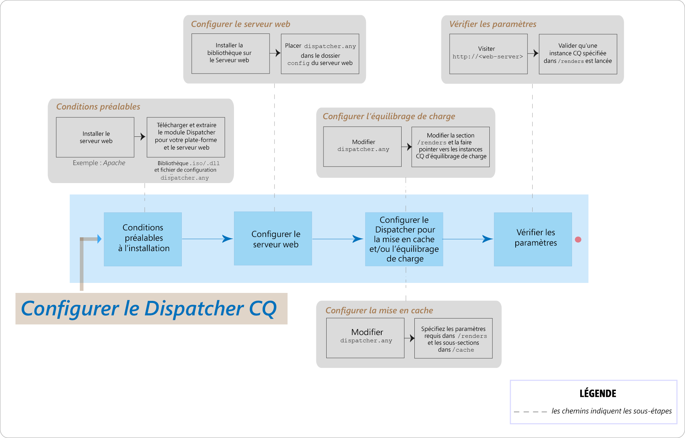

# FAQ sur les problèmes fréquents d’AEM Dispatcher



## Introduction

### Qu’est-ce que Dispatcher ?

Dispatcher est l’outil de répartition de charge et/ou de mise en cache d’Adobe Experience Manager qui permet de créer un environnement de création web rapide et dynamique. Pour la mise en cache, Dispatcher fonctionne comme faisant partie d’un serveur HTTP, tel qu’Apache, dans le but de stocker (ou de « mettre en cache ») autant de contenus du site web statique que possible et d’accéder le plus souvent possible au moteur de mise en page du site web. Dans un rôle de répartition de charge, Dispatcher répartit les requêtes des utilisateurs (charge) sur différentes instances (rendus) AEM.

Pour la mise en cache, le module Dispatcher utilise la capacité du serveur web à fournir du contenu statique. Dispatcher place les documents mis en cache à la racine du document du serveur web.

### Comment Dispatcher effectue-t-il la mise en cache ?

Dispatcher utilise la capacité du serveur web pour diffuser du contenu statique. Dispatcher stocke les documents mis en cache dans la racine du document du serveur web. Dispatcher dispose de deux méthodes principales pour mettre à jour le contenu du cache lorsque des modifications sont apportées au site web.

* **Les mises à jour de contenu** suppriment les pages qui ont été modifiées, ainsi que les fichiers qui leur sont directement associés.
* **L’invalidation automatique** invalide automatiquement les parties du cache susceptibles d’être obsolètes après une mise à jour. Par exemple, l’invalidation automatique marque les pages correspondantes comme étant obsolètes, sans rien supprimer.

### Quels sont les avantages de la répartition de charge ?

La répartition de charge répartit les requêtes utilisateur (charge) sur plusieurs instances AEM. La liste suivante décrit les avantages de la répartition de charge :

* **Puissance de traitement accrue** : en pratique, cela signifie que Dispatcher partage des requêtes de document entre plusieurs instances d’AEM. Chaque instance ayant désormais moins de documents à traiter, les délais de réponse sont plus rapides. Dispatcher conserve les statistiques internes pour chaque catégorie de document afin qu’il puisse estimer la charge et distribuer les requêtes efficacement.
* **Couverture de sécurité intégrée accrue** : si Dispatcher ne reçoit aucune réponse de la part d’une instance, il transmet automatiquement les demandes à l’une des autres instances. Par conséquent, si une instance n’est plus disponible, le seul effet est un ralentissement du site, proportionnel à la puissance de calcul perdue.

>[!NOTE]
>
>Pour plus d’informations, voir la [page Aperçu de Dispatcher](dispatcher.md)

## Installation et configuration d’AEM

### Où télécharger le module Dispatcher ?

Vous pouvez télécharger le dernier module Dispatcher sur la page [Notes de mise à jour de Dispatcher](release-notes.md).

### Comment installer le module Dispatcher ?

Voir la page [Installation de Dispatcher](dispatcher-install.md)

### Comment configurer le module Dispatcher ?

Voir la page [Configuration de Dispatcher](dispatcher-configuration.md).

### Comment configurer le Dispatcher pour l’instance d’auteur ?

Voir [Utilisation de Dispatcher avec une instance d’auteur](dispatcher.md#using-a-dispatcher-with-an-author-server) pour connaître les étapes détaillées.

### Comment configurer Dispatcher avec plusieurs domaines ?

Vous pouvez configurer Dispatcher CQ avec plusieurs domaines, à condition que les domaines respectent les conditions suivantes :

* Le contenu web des deux domaines est stocké dans un référentiel AEM unique
* Les fichiers du cache de Dispatcher peuvent être invalidés séparément pour chaque domaine

Pour plus d’informations, voir [Utiliser Dispatcher avec plusieurs domaines](dispatcher-domains.md).

### Comment configurer Dispatcher de sorte que toutes les requêtes d’un utilisateur soient acheminées vers la même instance de publication ?

Vous pouvez utiliser la fonctionnalité de [connexions persistantes](dispatcher-configuration.md#identifying-a-sticky-connection-folder-stickyconnectionsfor), qui garantit que tous les documents d’un utilisateur sont traités sur la même instance d’AEM. Cette fonctionnalité est importante si vous utilisez des pages personnalisées et des données de session. Les données sont stockées sur l’instance. Par conséquent, les requêtes suivantes, émanant du même utilisateur, doivent renvoyer à cette instance. Dans le cas contraire, les données seront perdues.

Les connexions persistantes limitent la capacité de Dispatcher à optimiser les requêtes. Vous devez les utiliser uniquement en cas de besoin. Vous pouvez spécifier le dossier qui contient les documents « persistants », assurant ainsi que tous les documents de ce dossier sont composés sur la même instance pour chaque utilisateur.

### Puis-je utiliser des connexions persistantes et la mise en cache en tandem ?

Désactivez la mise en cache de la plupart des pages qui utilisent des connexions persistantes. Sinon, la même instance de la page s’affichera pour tous les utilisateurs, quel que soit le contenu de la session.

Pour certaines applications, il peut être possible d’utiliser à la fois des connexions persistantes et une mise en cache. Par exemple, si vous affichez un formulaire qui écrit des données à une session, vous pouvez utiliser des connexions persistantes et une mise en cache.

### Dispatcher et une instance AEM de publication peuvent-ils résider sur le même ordinateur physique ?

Oui, si l’ordinateur est suffisamment puissant. Toutefois, il est recommandé de configurer Dispatcher et l’instance AEM de publication sur différents ordinateurs.

En règle générale, l’instance de publication se trouve à l’intérieur du pare-feu et le répartiteur réside dans la zone démilitarisée. Si vous décidez de disposer à la fois de l’instance de publication et de Dispatcher sur la même machine physique, assurez-vous que les paramètres du pare-feu interdisent l’accès direct à l’instance de publication à partir de réseaux externes.

### Puis-je mettre en cache uniquement les fichiers avec des extensions spécifiques ?

Oui. Par exemple, si vous souhaitez mettre en cache uniquement les fichiers GIF, spécifiez *.gif dans la section cache du fichier de configuration dispatcher.any.

### Comment supprimer des fichiers du cache ?

Vous pouvez supprimer des fichiers du cache à l’aide d’une requête HTTP. Lorsque la requête HTTP est reçue, Dispatcher supprime les fichiers du cache. Dispatcher met à nouveau les fichiers en cache uniquement lorsqu’il reçoit une requête client pour la page. Cette méthode de suppression de fichiers mis en cache convient aux sites web peu susceptibles de recevoir des requêtes simultanées pour la même page.

La requête HTTP présente la syntaxe suivante :

```
POST /dispatcher/invalidate.cache HTTP/1.1
CQ-Action: Activate
CQ-Handle: path-pattern
Content-Length: 0
```

Dispatcher supprime les fichiers et les dossiers mis en cache et dont les noms correspondent à la valeur de l’en-tête CQ. Par exemple, une CQ-Handle de `/content/geomtrixx-outdoors/en` correspond aux éléments suivants :

Tous les fichiers (d’une extension de fichier) nommés en dans le répertoire geometrixx-outdoors.
Les répertoires nommés `_jcr_content` sous le répertoire en (qui, s’il existe, contient des rendus en mémoire cache des sous-nœuds de la page).
Le répertoire en ne sera supprimé que si le `CQ-Action` est `Delete` ou `Deactivate`.

Pour plus d’informations sur cette rubrique, voir [Invalidation manuelle du cache de Dispatcher](page-invalidate.md).

### Comment implémenter la mise en cache sensible aux autorisations ?

Voir la page [Mise en cache de contenu sécurisé](permissions-cache.md).

### Comment sécuriser les communications entre les instances Dispatcher et CQ ?

Consultez les pages [Liste de contrôle de sécurité du répartiteur](security-checklist.md) et [Liste de contrôle de sécurité AEM](https://helpx.adobe.com/fr/experience-manager/6-4/sites/administering/using/security-checklist.html).

### Le problème lié à `jcr:content` de Dispatcher a été remplacé par `jcr%3acontent`

**Question** : nous avons récemment rencontré un problème au niveau de Dispatcher, dans lequel l’un des appels ajax qui obtient un référentiel CQ de formulaire de données contenait `jcr:content` et qui était codé pour `jcr%3acontent` produisant ainsi un jeu de résultats incorrect.

**Réponse** : utilisez la méthode `ResourceResolver.map()` pour obtenir une URL « conviviale » qui permet d’utiliser/recevoir des requêtes d’origine et de résoudre le problème de mise en cache avec Dispatcher. La méthode map() code les deux points `:` en caractères de soulignement et la méthode resolve() les décode au format lisible SLING JCR. Utilisez la méthode map() pour générer l’URL utilisée dans l’appel Ajax.

Lire plus loin : [https://sling.apache.org/documentation/the-sling-engine/mappings-for-resource-resolution.html#namespace-mangling](https://sling.apache.org/documentation/the-sling-engine/mappings-for-resource-resolution.html#namespace-mangling)

## Purge de Dispatcher

### Comment configurer les agents de purge de Dispatcher sur une instance de publication ?

Voir la page [Réplication](https://helpx.adobe.com/content/help/en/experience-manager/6-4/sites/deploying/using/replication.html#ConfiguringyourReplicationAgents).

### Comment résoudre les problèmes de purge de Dispatcher ?

[Reportez-vous à cet ](https://helpx.adobe.com/content/help/en/experience-manager/kb/troubleshooting-dispatcher-flushing-issues.html) article de dépannage qui répond aux questions suivantes :

* Comment déboguer une situation où aucun contenu n’est enregistré dans le cache de Dispatcher ?
* Comment déboguer une situation où les fichiers de cache ne sont pas mis à jour ?
* Comment déboguer une situation bloquée en raison de la purge de Dispatcher ?

Si les opérations de suppression incitent Dispatcher à vider, [utilisez la solution dans cette publication de blog de la communauté de Sensei Martin](https://mkalugin-cq.blogspot.in/2012/04/i-have-been-working-on-following.html).

### Comment vider les ressources DAM du cache de Dispatcher ?

Vous pouvez utiliser la fonctionnalité de « réplication de chaînes ».  Lorsque cette fonction est activée, l’agent de purge de Dispatcher envoie une requête de purge lorsqu’une réplication est reçue de l’auteur.

Pour l’activer :

1. [Suivez les étapes ci-dessous](page-invalidate.md#invalidating-dispatcher-cache-from-a-publishing-instance) pour créer des agents de purge sur publication.
1. Accédez à chaque configuration de l’agent et, sous l’onglet **Déclencheurs**, activez la case à cocher **À réception**.

## Divers

Comment Dispatcher détermine-t-il si un document est à jour ?
Pour déterminer si un document est à jour, Dispatcher effectue les actions suivantes :

Il vérifie si le document est soumis à l’invalidation automatique. Si ce n’est pas le cas, le document est considéré comme étant à jour.
Si le document est configuré pour l’invalidation automatique, Dispatcher vérifie s’il est plus ancien ou plus récent que la dernière modification disponible. S’il est plus ancien, Dispatcher demande la version actuelle à l’instance AEM et remplace la version dans le cache.

### Comment Dispatcher renvoie-t-il des documents ?

Vous pouvez définir si Dispatcher met en cache un document à l’aide [du fichier de configuration](dispatcher-configuration.md) de Dispatcher `dispatcher.any`. Dispatcher vérifie la demande au niveau de la liste des documents pouvant être mis en cache. Si le document ne figure pas dans cette liste, Dispatcher demande le document à l’instance AEM.

La propriété `/rules` contrôle les documents qui sont mis en cache selon le chemin d’accès au document. Quelle que soit la propriété `/rules`, Dispatcher ne procède jamais à la mise en cache d’un document dans les cas suivants :

* Si l’URI de demande contient un point d’interrogation `(?)`.
* Cela indique généralement une page dynamique, par exemple un résultat de recherche qui n’a pas besoin d’être mis en cache.
* L’extension de fichier est manquante.
* Le serveur web a besoin de l’extension pour déterminer le type de document (type MIME).
* L’en-tête d’authentification est défini (vous pouvez le configurer).
* Si l’instance AEM répond avec les en-têtes suivants :
   * no-cache
   * no-store
   * must-revalidate

Dispatcher stocke les fichiers mis en cache sur le serveur web comme s’ils faisaient partie d’un site web statique. Si l’utilisateur demande un document pouvant être mis en cache, Dispatcher vérifie si le document existe dans le système de fichiers du serveur web. Si tel est le cas, Dispatcher renvoie les documents. Sinon, Dispatcher demande le document à l’instance AEM.

>[!NOTE]
>
>Les méthodes GET ou HEAD (pour les en-têtes HTTP) sont mises en cache par Dispatcher. Pour plus d’informations sur la mise en cache des en-têtes de réponse, voir [Mise en cache des en-têtes de réponse HTTP](dispatcher-configuration.md#caching-http-response-headers).

### Puis-je implémenter plusieurs Dispatcher dans une configuration ?

Oui. Dans ce cas, assurez-vous que les deux Dispatcher peuvent accéder directement au site web AEM. Un Dispatcher ne peut pas traiter les requêtes provenant d’un autre Dispatcher.

