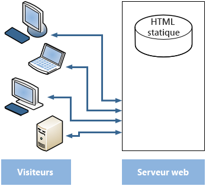
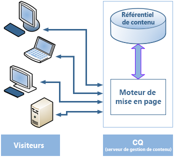
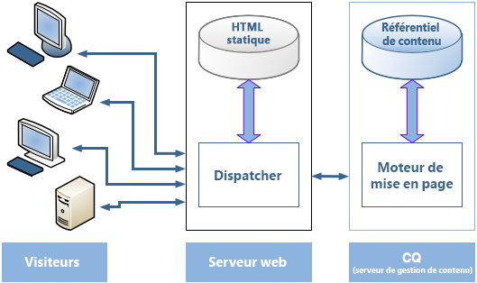
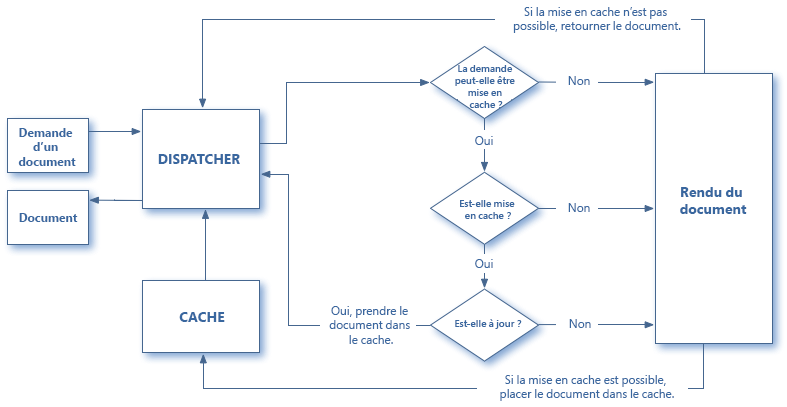
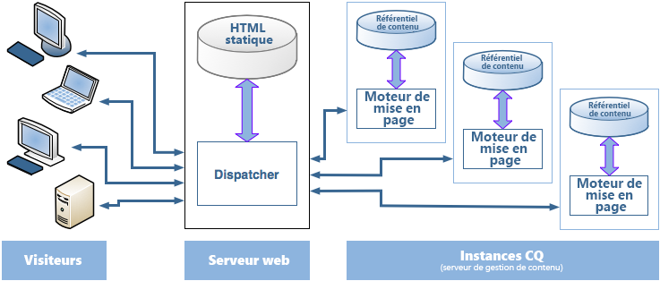

# Présentation de Dispatcher {#dispatcher-overview}

>[!NOTE]
>
>Les versions de Dispatcher sont indépendantes d’AEM. Vous avez été redirigé vers cette page si vous avez suivi un lien vers la documentation de Dispatcher incluse dans la documentation d’une précédente version d’AEM.

Le Dispatcher est l’outil de mise en cache et/ou d’équilibrage de charge d’Adobe Experience Manager. L’utilisation du Dispatcher AEM contribue également à protéger le serveur AEM contre les attaques. Vous pouvez donc accroître la sécurité de l’instance AEM en utilisant le Dispatcher conjointement à un serveur web de niveau élevé.

La procédure de déploiement de Dispatcher est indépendante du serveur web et de la plateforme du système d’exploitation :

1. En savoir plus sur Dispatcher (cette page). En outre, voir [les questions fréquentes sur Dispatcher](https://helpx.adobe.com/experience-manager/using/dispatcher-faq.html).
1. Install a [supported web server](https://helpx.adobe.com/fr/experience-manager/6-3/sites/deploying/using/technical-requirements.html) according to the web server documentation.
1. [Installez le module Dispatcher](dispatcher-install.md) sur votre serveur web et configurez-le en conséquence.
1. [Configurez Dispatcher](dispatcher-configuration.md) (fichier dispatcher.any).
1. [Configurez AEM](page-invalidate.md) pour que les mises à jour de contenu invalident le cache.

>[!NOTE]
>
>Pour mieux comprendre comment le Répartiteur fonctionne avec AEM :
>
>* Voir [Demander aux experts de la communauté AEM pour juillet 2017](https://bit.ly/ATACE0717).
>* Accédez à [ce référentiel](https://github.com/adobe/aem-dispatcher-experiments). Il contient une collection d&#39;expériences en laboratoire &quot;à emporter&quot;.


Utilisez les informations suivantes, selon vos besoins :

* [Liste de contrôle de sécurité de Dispatcher](security-checklist.md)
* [Base de connaissances de Dispatcher](https://helpx.adobe.com/cq/kb/index/dispatcher.html)
* [Optimisation d’un site web pour les performances du cache](https://helpx.adobe.com/fr/experience-manager/6-4/sites/deploying/using/configuring-performance.html)
* [Utilisation de Dispatcher avec plusieurs domaines](dispatcher-domains.md)
* [Utilisation du protocole SSL avec Dispatcher](dispatcher-ssl.md)
* [Mise en œuvre de la mise en cache sensible aux autorisations](permissions-cache.md)
* [Résolution des problèmes liés à Dispatcher](dispatcher-troubleshooting.md)
* [FAQ sur les problèmes fréquents de Dispatcher](dispatcher-faq.md)

>[!NOTE]
>
>******L’utilisation la plus courante du Dispatcher consiste à mettre en cache les réponses d’une instance de publication AEM** pour améliorer la réactivité et la sécurité du site web publié en externe. La plupart des sujets abordés se concentrent sur ce cas.
>
>En revanche, vous pouvez également utiliser Dispatcher pour améliorer la réactivité de l’**instance de création**, en particulier si un grand nombre d’utilisateurs est en train de modifier et de mettre à jour le site web. Pour obtenir des informations spécifiques à ce cas, voir [Utilisation d’un Dispatcher avec un serveur de création](#using-a-dispatcher-with-an-author-server) ci-dessous.

## Pourquoi utiliser Dispatcher pour mettre en œuvre la mise en cache ?  {#why-use-dispatcher-to-implement-caching}

Il existe deux approches possibles pour la publication web :

* **Serveurs web statiques** : par exemple Apache ou IIS. Ils sont très simples, mais rapides.
* **Serveurs de gestion de contenu** : ils fournissent du contenu dynamique et intelligent en temps réel, mais nécessitent davantage de temps de calcul et d’autres ressources.

Dispatcher contribue à la mise en place d’un environnement à la fois rapide et dynamique. Il fonctionne comme un composant d’un serveur HTML statique, par exemple Apache, dans le but :

* de stocker (ou « mettre en cache ») la plus grande partie du contenu du site possible, sous la forme d’un site web statique ;
* de limiter l’accès au moteur de mise en page.

Cela signifie que :

* **le contenu statique** est géré avec la même rapidité et la même facilité que sur un serveur web statique, *mais vous pouvez également utiliser les outils d’administration et de sécurité disponibles pour vos serveurs web statiques*.

* **le contenu dynamique** est généré en fonction des besoins, sans ralentir le système plus que nécessaire.

Dispatcher contient des mécanismes permettant de générer et de mettre à jour du code HTML statique en fonction du contenu du site dynamique. Vous pouvez spécifier en détail les documents qui sont stockés sous forme de fichiers statiques et ceux qui sont systématiquement générés de façon dynamique.

Cette section illustre les principes de cet environnement.

### Serveur web statique  {#static-web-server}



Un serveur web statique, par exemple Apache ou IIS, diffuse les fichiers HTML statiques aux visiteurs du site web. Les pages statiques sont créées une seule fois, de sorte que le même contenu est fourni pour chaque demande.

Ce processus est très simple et, de ce fait, très efficace. Si un visiteur demande un fichier (par exemple une page HTML), il est généralement extrait directement de la mémoire. Sinon, il est lu depuis le disque local. Les serveurs web statiques existent depuis longtemps. De ce fait, il existe une grande variété d’outils pour l’administration et la gestion de la sécurité, et ils sont parfaitement intégrés aux infrastructures réseau.

### Serveurs de gestion de contenu  {#content-management-servers}



Si vous utilisez un serveur de gestion de contenu, par exemple AEM, un moteur de mise en page avancé traite la demande d’un visiteur. Le moteur lit le contenu à partir d’un référentiel qui, associé à des styles, formats et droits d’accès, transforme le contenu en un document qui est adapté aux besoins et droits du visiteur.

Vous pouvez ainsi créer un contenu plus évolué, dynamique, qui améliore la souplesse et la fonctionnalité du site web. Toutefois, le moteur de mise en page nécessite davantage de puissance de traitement qu’un serveur statique, de sorte que cette configuration peut être sujette à un ralentissement si de nombreux visiteurs utilisent le système.

## Procédure de mise en cache par Dispatcher  {#how-dispatcher-performs-caching}



**Répertoire du cache** Pour la mise en cache, le module Dispatcher utilise la capacité du serveur web à fournir du contenu statique. Dispatcher place les documents mis en cache à la racine du document du serveur web.

>[!NOTE]
>
>Lorsque la configuration de la mise en cache HTTP est manquante, Dispatcher stocke uniquement le code HTML de la page ; il ne stocke pas les en-têtes HTTP. Cela peut créer un problème si vous utilisez différents codages pour le site web, car ceux-ci peuvent être perdus. Pour activer la mise en cache des en-têtes HTTP, voir [Configuration du cache de Dispatcher.](https://helpx.adobe.com/fr/experience-manager/dispatcher/using/dispatcher-configuration.html)

>[!NOTE]
>
>La localisation de la racine du document du serveur web sur le périphérique de stockage réseau (NAS) entraîne une dégradation des performances. De même, lorsqu’une racine de document située sur le NAS est partagée entre plusieurs serveurs web, des verrous intermittents peuvent se produire lorsque des actions de réplication sont effectuées.

>[!NOTE]
>
>Dispatcher stocke le document mis en cache dans une structure équivalente à l’URL demandée.
>
>Le système d’exploitation peut limiter la longueur du nom de fichier, par exemple, si votre URL comporte de nombreux sélecteurs.

### Méthodes de mise en cache

Dispatcher dispose de deux méthodes principales pour mettre à jour le contenu du cache lorsque des modifications sont apportées au site web.

* **Les mises à jour de contenu** suppriment les pages qui ont été modifiées, ainsi que les fichiers qui leur sont directement associés.
* **L’invalidation automatique** invalide automatiquement les parties du cache susceptibles d’être obsolètes après une mise à jour. L’invalidation automatique marque les pages correspondantes comme étant obsolètes, sans rien supprimer.

### Mises à jour du contenu

Lors d’une mise à jour du contenu, un ou plusieurs documents AEM sont modifiés. AEM envoie une demande de syndication à Dispatcher, qui met à jour le cache en conséquence :

1. Cela supprime les fichiers modifiés du cache.
1. Cela supprime tous les fichiers commençant par le même descripteur du cache. Par exemple, si le fichier /fr/index.html est mis à jour, tous les fichiers qui commencent par /fr/index sont supprimés. Ce mécanisme permet de concevoir des sites dont la mise en cache est performante, en particulier en termes de navigation dans des images.
1. Cela *modifie* le fichier dont l’extension est **stat**, ce qui met à jour son horodatage afin d’indiquer la date de la dernière modification.

Notez ce qui suit :

* Les mises à jour du contenu sont habituellement employées en même temps qu’un système de création qui « sait » ce qui doit être remplacé.
* Les fichiers qui sont affectés par une mise à jour du contenu sont supprimés, mais pas remplacés immédiatement. La prochaine fois qu’un tel fichier est demandé, Dispatcher récupère le nouveau fichier auprès de l’instance AEM et le place dans le cache, écrasant ainsi le contenu obsolète.
* En règle générale, les images générées automatiquement avec le texte d’une page sont stockées dans des fichiers images commençant par le même descripteur, garantissant ainsi que l’association existe pour la suppression. Vous pouvez, par exemple, stocker le texte du titre de la page mapage.html en tant qu’image mapage.titreImage.gif dans le même dossier. Ainsi, l’image est automatiquement supprimée du cache chaque fois que la page est mise à jour. Vous êtes ainsi certain que l’image reflète toujours la version actuelle de la page.
* Vous pouvez disposer de plusieurs fichiers stat, par exemple un par dossier de langue. Si une page est mise à jour, AEM recherche le dossier parent suivant contenant un fichier stat, puis *modifie* ce fichier.

### Invalidation automatique

L’invalidation automatique invalide automatiquement des parties du cache, sans supprimer physiquement aucun fichier. À chaque mise à jour du contenu, le fichier stat est modifié afin que son horodatage indique la dernière mise à jour du contenu.

Dispatcher comprend une liste de fichiers qui sont soumis à l’invalidation automatique. Lorsqu’un document de cette liste est demandé, Dispatcher compare la date du document mis en cache à l’horodatage du fichier stat :

* si le document mis en cache est plus récent, Dispatcher le renvoie ;
* s’il est plus ancien, Dispatcher récupère la version actuelle dans l’instance AEM.

Notez également ce qui suit :

* L’invalidation automatique est généralement utilisée lorsque les interdépendances sont complexes, par exemple pour les pages HTML. Ces pages contiennent des liens et des entrées de navigation. Par conséquent, elles doivent généralement être mises à jour après une mise à jour du contenu. Si vous avez automatiquement généré des fichiers PDF ou image, vous pouvez également choisir de les invalider automatiquement.
* L’invalidation automatique n’inclut aucune action de la part de Dispatcher au moment de la mise à jour, hormis la modification du fichier stat. Toutefois, la modification automatique du fichier stat rend le contenu du cache obsolète, sans le supprimer physiquement du cache.

## Procédure de renvoi des documents par Dispatcher  {#how-dispatcher-returns-documents}



### Déterminer si le document est soumis à la mise en cache

You can [define which documents the Dispatcher caches in the configuration file](https://helpx.adobe.com/fr/experience-manager/dispatcher/using/dispatcher-configuration.html). Dispatcher vérifie la demande au niveau de la liste des documents pouvant être mis en cache. Si le document ne figure pas dans cette liste, Dispatcher demande le document à l’instance AEM.

Dispatcher demande *toujours* le document directement à partir de l’instance AEM dans les cas suivants :

* Si l’URI de demande contient un point d’interrogation « ? ». Cela indique généralement une page dynamique, par exemple un résultat de recherche, qui n’a pas besoin d’être mis en cache.
* L’extension de fichier est manquante. Le serveur web a besoin de l’extension pour déterminer le type de document (type MIME).
* L’en-tête d’authentification est défini (vous pouvez le configurer).

>[!NOTE]
>
>Les méthodes GET ou HEAD (pour les en-têtes HTTP) sont mises en cache par Dispatcher. Pour plus d’informations sur la mise en cache des en-têtes de réponse, voir [Mise en cache des en-têtes de réponse HTTP](https://helpx.adobe.com/fr/experience-manager/dispatcher/using/dispatcher-configuration.html).

### Déterminer si un document est mis en cache

Dispatcher stocke les fichiers mis en cache sur le serveur web comme s’ils faisaient partie d’un site web statique. Si l’utilisateur demande un document pouvant être mis en cache, Dispatcher vérifie si le document existe dans le système de fichiers du serveur web :

* si le document est mis en cache, Dispatcher renvoie le fichier ;
* s’il n’est pas mis en cache, Dispatcher demande le document à l’instance AEM.

### Déterminer si le document est à jour

Dispatcher vérifie si un document est à jour en deux étapes :

1. Il vérifie si le document est soumis à l’invalidation automatique. Si ce n’est pas le cas, le document est considéré comme étant à jour.
1. Si le document est configuré pour l’invalidation automatique, Dispatcher vérifie s’il est plus ancien ou plus récent que la dernière modification disponible. S’il est plus ancien, Dispatcher demande la version actuelle à l’instance AEM et remplace la version dans le cache.

>[!NOTE]
>
>Les documents sans **invalidation automatique** restent dans le cache jusqu’à ce qu’ils soient physiquement supprimés, par exemple par une mise à jour du contenu du site web.

## Les avantages de l’équilibrage de charge {#the-benefits-of-load-balancing}

L’équilibrage de charge consiste à distribuer la charge de calcul du site web sur plusieurs instances d’AEM.



Vous bénéficiez des avantages suivants :

* **Puissance de traitement accrue** En pratique, cela signifie que Dispatcher partage des demandes de document entre plusieurs instances d’AEM. Chaque instance ayant désormais moins de documents à traiter, les délais de réponse sont plus rapides. Dispatcher conserve les statistiques internes pour chaque catégorie de document afin qu’il puisse estimer la charge et distribuer les requêtes efficacement.

* **Couverture de sécurité intégrée accrue** Si Dispatcher ne reçoit aucune réponse de la part d’une instance, il transmet automatiquement les demandes à l’une des autres instances. Par conséquent, si une instance n’est plus disponible, le seul effet est un ralentissement du site, proportionnel à la puissance de calcul perdue. Toutefois, tous les services continuent de fonctionner.

* Vous pouvez également gérer plusieurs sites web dans le même serveur web statique.

>[!NOTE]
>
>Alors que l’équilibrage de charge répartit la charge efficacement, la mise en cache permet de la réduire. Par conséquent, essayez d’optimiser la mise en cache et de réduire la charge globale avant de configurer l’équilibrage de charge. Une mise en cache appropriée permet d’améliorer les performances de l’équilibreur de charge, voire de rendre l’équilibrage de charge inutile.

>[!CAUTION]
>
>Alors qu’une seule instance Dispatcher peut souvent saturer la capacité des instances de publication disponibles, pour certaines applications rares, il peut s’avérer judicieux d’équilibrer en plus la charge entre deux instances de Dispatcher. Les configurations avec plusieurs instances de Dispatcher doivent être envisagées avec soin, car une instance supplémentaire de Dispatcher accroît la charge sur les instances de publication disponibles et risque de réduire les performances de la plupart des applications.

## Exécution de l’équilibrage de charge par Dispatcher  {#how-the-dispatcher-performs-load-balancing}

### Statistiques de performances

Dispatcher conserve les statistiques internes sur la vitesse à laquelle chacune des instances d’AEM traite les documents. En fonction de ces données, Dispatcher estime l’instance qui fournit le temps de réponse le plus rapide lors de la réponse à une demande afin de réserver le temps nécessaire de calcul sur cette instance.

Les différents types de demande peuvent avoir des temps d’exécution moyens différents. De ce fait, Dispatcher permet de spécifier les catégories de document. Elles sont ensuite prises en compte lors du calcul des estimations de durée. Par exemple, vous pouvez effectuer une distinction entre les pages HTML et les images, car leurs délais de réponse types peuvent également varier.

Si vous utilisez une fonction de recherche élaborée, vous pouvez créer une catégorie pour les requêtes de recherche. Cela permet à Dispatcher d’envoyer des requêtes de recherche à l’instance qui répond le plus rapidement. Cela empêche une instance plus lente de créer un blocage lorsqu’elle reçoit plusieurs requêtes de recherche « coûteuses », alors que les autres reçoivent des requêtes « moins coûteuses ».

### Contenu personnalisé (connexions persistantes)

Les connexions persistantes garantissent que les documents d’un utilisateur sont tous composés sur la même instance d’AEM. Ceci est important si vous utilisez des pages personnalisées et des données de session. Les données sont stockées sur l’instance. De ce fait, les demandes ultérieures du même utilisateur doivent retourner à cette instance, sinon les données sont perdues.

Les connexions persistantes limitent la capacité de Dispatcher à optimiser les demandes. Vous devez les utiliser uniquement en cas de besoin. Vous pouvez spécifier le dossier qui contient les documents « persistants », assurant ainsi que tous les documents de ce dossier sont composés sur la même instance pour chaque utilisateur.

>[!NOTE]
>
>Pour la plupart des pages qui utilisent des connexions persistantes, vous devez désactiver la mise en cache ; sinon la page s’affiche exactement de la même manière pour tous les utilisateurs, quel que soit le contenu de la session.
>
>Pour *quelques* applications, il est éventuellement possible d’utiliser à la fois des connexions persistantes et la mise en cache ; par exemple, si vous affichez un formulaire qui écrit des données dans la session.

## Utilisation de plusieurs instances de Dispatcher {#using-multiple-dispatchers}

Avec des configurations complexes, vous pouvez utiliser plusieurs instances de Dispatcher. Par exemple, vous pouvez utiliser :

* une instance de Dispatcher pour publier un site web sur l’intranet ;
* une seconde instance, à une autre adresse et avec d’autres paramètres de sécurité, pour publier le même contenu sur Internet.

Dans ce cas, veillez à ce que chaque demande passe par une seule instance de Dispatcher. Une instance de Dispatcher ne traite pas les demandes provenant d’une autre instance. Par conséquent, assurez-vous que les deux instances de Dispatcher accèdent directement au site web AEM.

## Utilisation de Dispatcher avec un CDN  {#using-dispatcher-with-a-cdn}

Un réseau de distribution de contenu (CDN), par exemple Akamai Edge Delivery ou Amazon Cloud Front, distribue du contenu à partir d’un emplacement proche de l’utilisateur final. Ainsi, il :

* accélère les temps de réponse pour les utilisateurs finaux ;
* soulage vos serveurs ;

En tant que composant d’infrastructure HTTP, un CDN fonctionne comme une instance de Dispatcher : lorsqu’un nœud CDN reçoit une demande, il diffuse la demande depuis son cache, si possible (la ressource est valide et disponible dans le cache). Autrement, il contacte le serveur suivant le plus proche pour récupérer la ressource et la mettre en cache pour d’autres demandes, le cas échéant.

Le « serveur suivant le plus proche » dépend de votre configuration spécifique. Par exemple, dans une installation Akamai, la requête peut prendre le chemin suivant :

* Le nœud Akamai Edge
* Le calque Akamai Midgres
* Votre pare-feu
* Votre équilibreur de charge 
* Dispatcher
* AEM

Dans la plupart des cas, Dispatcher est le serveur suivant qui peut diffuser le document depuis un cache et influencer les en-têtes de réponse renvoyés au serveur CDN.

## Contrôle d’un cache CDN  {#controlling-a-cdn-cache}

Il existe plusieurs méthodes de contrôle de la durée pendant laquelle un CDN met en cache une ressource avant qu’elle ne soit récupérée auprès de Dispatcher.

1. Configuration explicite\
   Configurez la durée pendant laquelle des ressources particulières sont conservées dans le cache du CDN, en fonction du type mime, de l’extension, du type de requête, etc.

1. En-têtes d’expiration et de contrôle du cache\
   La plupart des CDN honoreront les en-têtes HTTP `Expires:` et `Cache-Control:` s’ils sont envoyés par le serveur en amont. Pour cela, il faut par exemple utiliser le module Apache [mod_expires](https://httpd.apache.org/docs/2.4/mod/mod_expires.html).

1. Invalidation manuelle\
   Les CDN permettent de supprimer des ressources du cache via des interfaces web.
1. Invalidation basée sur l’API\
   La plupart des CDN offrent également une API REST et/ou SOAP qui permet de supprimer des ressources du cache.

Dans une configuration standard d’AEM, la configuration par extension et/ou chemin d’accès, qui peut être obtenue en suivant les points 1 et 2 ci-dessus, offre des possibilités pour définir des périodes de mise en cache raisonnables pour les ressources utilisées fréquemment qui ne changent pas souvent, comme les images de conception et les bibliothèques client. Lorsque de nouvelles versions sont déployées, une invalidation manuelle est généralement nécessaire.

Si cette approche est utilisée pour mettre en cache du contenu géré, cela implique que les modifications du contenu sont uniquement visibles par les utilisateurs finaux une fois que la période de mise en cache configurée est arrivée à expiration et que le document est récupéré à partir de Dispatcher.

Pour un contrôle plus affiné, l’invalidation basée sur l’API vous permet d’invalider le cache d’un CDN si le cache de Dispatcher est invalidé. Sur la base de l’API du CDN, vous pouvez implémenter vos propres [ContentBuilder](https://helpx.adobe.com/experience-manager/6-5/sites/developing/using/reference-materials/javadoc/com/day/cq/replication/ContentBuilder.html) et [TransportHandler](https://helpx.adobe.com/experience-manager/6-5/sites/developing/using/reference-materials/javadoc/com/day/cq/replication/TransportHandler.html) (si l’API n’est pas basée sur REST) et configurer un agent de réplication qui utilise ces derniers pour invalider le cache du CDN.

>[!NOTE]
>
>Voir aussi [Sécurité de Dispatcher AEM (CQ) et mise en cache CDN+Navigateur](https://www.slideshare.net/andrewmkhoury/dispatcher-caching-aemgemspart2jan2015) ainsi que la présentation enregistrée sur [la mise en cache de Dispatcher](https://docs.adobe.com/content/ddc/en/gems/dispatcher-caching---new-features-and-optimizations.html).

## Utilisation de Dispatcher avec un serveur de création {#using-a-dispatcher-with-an-author-server}

>[!CAUTION]
>
>if you are using [AEM with Touch UI](https://helpx.adobe.com/experience-manager/6-3/sites/developing/using/touch-ui-concepts.html) you should **not** cache author instance content. Si la mise en cache a été activée pour l’instance d’auteur, vous devez la désactiver et supprimer le contenu du répertoire du cache. Pour désactiver la mise en cache, vous devez modifier le fichier `author_dispatcher.any` et modifier la propriété `/rule` de la section `/cache` comme suit :

```xml
/rules
{
/0000
{ /type "deny" /glob "*"}
}
```

Vous pouvez utiliser Dispatcher en regard d’une instance de création pour améliorer les performances de création. Pour configurer une instance Dispatcher de création, procédez comme suit :

1. Installez Dispatcher sur un serveur web (serveur web Apache ou IIS, voir [Installation de Dispatcher](dispatcher-install.md)).
1. Vous pouvez tester l’instance Dispatcher nouvellement installée par rapport à une instance de publication AEM afin de vous assurer que l’installation de la ligne de base est correcte.
1. Vérifiez ensuite que Dispatcher parvient à se connecter à l’instance de création via TCP/IP.
1. Remplacez l’exemple de fichier dispatcher.any par le fichier author_dispatcher.any, fourni avec le [téléchargement de Dispatcher](release-notes.md#downloads).
1. Ouvrez le `author_dispatcher.any` dans un éditeur de texte et apportez les modifications suivantes :

   1. Modifiez `/hostname` et `/port` dans la section `/renders` pour qu’ils pointent vers votre instance d’auteur.
   1. Modifiez `/docroot` dans la section `/cache` pour qu’il pointe vers un répertoire de cache. Si vous utilisez [AEM avec interface utilisateur](https://helpx.adobe.com/experience-manager/6-3/sites/developing/using/touch-ui-concepts.html)tactile, reportez-vous à l’avertissement ci-dessus.
   1. Enregistrez les modifications.

1. Supprimez tous les fichiers existants dans le répertoire `/cache` > `/docroot` que vous avez configuré ci-dessus.
1. Redémarrez le serveur web.

>[!NOTE]
>
>Veuillez noter qu’avec la configuration `author_dispatcher.any` fournie, lorsque vous installez un module de fonctions, correctif ou package de code d’application CQ5 qui affecte un contenu situé sous `/libs` ou `/apps`, vous devez supprimer les fichiers mis en cache sous ces répertoires, dans votre cache de Dispatcher, pour vous assurer que la prochaine fois qu’ils seront demandés, les fichiers récemment mis à niveau seront récupérés, et non les anciens mis en cache.

>[!CAUTION]
>
>Si vous avez utilisé l’instance Dispatcher de création configurée précédemment et si vous avez activé un *agent de purge du répartiteur*, procédez comme suit :

1. Supprimez ou désactivez l’agent de purge de **l’instance Dispatcher de création** sur votre instance d’auteur AEM.
1. Rétablissez la configuration du Dispatcher de création en suivant les nouvelles instructions ci-dessus.

<!--
[Author Dispatcher configuration file (Dispatcher 4.1.2 or later)](assets/author_dispatchernew.any)
-->
<!--[!NOTE]
>
>A related knowledge base article can be found here:  
>[How to configure the dispatcher in front of an authoring environment](https://helpx.adobe.com/cq/kb/HowToConfigureDispatcherForAuthoringEnvironment.html)
-->
