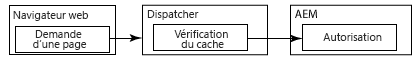

# Mise en cache du contenu sécurisé {#caching-secured-content}

La mise en cache sensible aux autorisations vous permet de mettre en cache des pages sécurisées. Dispatcher vérifie les droits d’accès à une page avant de diffuser la page en cache.

Dispatcher inclut le module AuthChecker, qui met en œuvre la mise en cache sensible aux autorisations. Lorsque le module est activé, Dispatcher appelle une servlet AEM pour effectuer l’authentification et l’autorisation de l’utilisateur pour le contenu demandé. La réponse du servlet détermine si le contenu est diffusé dans le navigateur web à partir du cache ou non.

Les méthodes d’authentification et d’autorisation étant spécifiques au déploiement d’AEM, vous devez créer le servlet.

>[!NOTE]
>
>Utilisez les filtres `deny` pour appliquer des restrictions liées à la couverture de sécurité. Utilisez la mise en cache sensible aux autorisations pour les pages qui sont configurées de manière à accorder l’accès à un sous-ensemble d’utilisateurs ou de groupes.

Les diagrammes ci-dessous illustrent l’ordre des événements qui se produisent lorsqu’un navigateur web demande une page sur laquelle la mise en cache sensible aux autorisations est utilisée.

## La page est mise en cache et l’utilisateur est autorisé  {#page-is-cached-and-user-is-authorized}


1. Dispatcher détermine que le contenu demandé est mis en cache et valide.
1. Dispatcher envoie une requête la fonctionnalité de rendu. La section HEAD inclut toutes les lignes d’en-tête de la requête du navigateur.
1. Le rendu appelle le servlet Auth checker pour effectuer la vérification de sécurité et répond à Dispatcher. Le message de réponse comprend le code d’état HTTP 200 pour indiquer que l’utilisateur est autorisé.
1. Dispatcher envoie un message de réponse au navigateur, avec les lignes d’en-tête de la réponse du rendu et le contenu mis en cache dans le corps.

## La page n’est pas mise en cache et l’utilisateur est autorisé  {#page-is-not-cached-and-user-is-authorized}


1. Dispatcher détermine que le contenu n’est pas mis en cache ou nécessite une mise à jour.
1. Dispatcher transfère la demande d’origine à la fonctionnalité de rendu.
1. Le rendu appelle le servlet d’autorisation d’AEM (il ne s’agit pas du servlet AuthChcker de Dispatcher) pour effectuer une vérification de sécurité. Lorsque l’utilisateur est autorisé, l’affichage inclut la page restituée dans le corps du message de réponse.
1. Dispatcher transfère la réponse au navigateur. Dispatcher ajoute le corps du message de réponse du rendu au cache.

## L’utilisateur n’est pas autorisé  {#user-is-not-authorized}



1. Dispatcher vérifie le cache.
1. Dispatcher envoie un message de demande à la fonctionnalité de rendu, avec toutes les lignes d’en-tête de la demande du navigateur.
1. Le rendu appelle le servlet Auth Checker pour effectuer une vérification de sécurité qui échoue et le rendu transfère la demande d’origine à Dispatcher.
1. Dispatcher transfère la demande d’origine à la fonctionnalité de rendu.
1. Le rendu appelle le servlet d’autorisation d’AEM (il ne s’agit pas du servlet AuthChcker de Dispatcher) pour effectuer une vérification de sécurité. Lorsque l’utilisateur est autorisé, l’affichage inclut la page restituée dans le corps du message de réponse.
1. Dispatcher transfère la réponse au navigateur. Dispatcher ajoute le corps du message de réponse du rendu au cache.

## Mise en œuvre de la mise en cache sensible aux autorisations {#implementing-permission-sensitive-caching}

Pour mettre en œuvre la mise en cache sensible aux autorisations, procédez comme suit :

* Développez un servlet qui effectue l’authentification et l’autorisation.
* Configurez Dispatcher.

>[!NOTE]
>
>En règle générale, les ressources sécurisées sont stockées dans un dossier distinct des fichiers non sécurisés. Par exemple, /content/secure/

>[!NOTE]
>
>Lorsqu’un CDN (ou tout autre cache) se trouve devant le Dispatcher, vous devez définir les en-têtes de mise en cache en conséquence afin que le CDN ne mette pas en cache le contenu privé. Par exemple : `Header always set Cache-Control private`.
>Pour AEM as a Cloud Service, voir [Mise en cache](https://experienceleague.adobe.com/docs/experience-manager-cloud-service/content/implementing/content-delivery/caching.html) pour plus d’informations sur la définition des en-têtes de mise en cache privés.

## Création du servlet Auth Checker {#create-the-auth-checker-servlet}

Créez et déployez un servlet qui authentifie et autorise l’utilisateur qui demande le contenu web. Le servlet peut utiliser n’importe quelle méthode d’authentification et d’autorisation, par exemple le compte utilisateur AEM, les listes de contrôle d’accès des référentiels ou un service de recherche LDAP. Déployez le servlet vers l’instance AEM que Dispatcher utilise comme rendu.

Le servlet doit être accessible à tous les utilisateurs. Par conséquent, votre servlet doit étendre la classe `org.apache.sling.api.servlets.SlingSafeMethodsServlet`, qui offre un accès en lecture seule au système.

Le servlet reçoit uniquement les demandes HEAD du rendu. Il suffit donc de mettre en œuvre la méthode `doHead`.

Le rendu inclut l’URI de la ressource demandée sous la forme d’un paramètre de requête HTTP. Par exemple, vous pouvez accéder à un servlet d’autorisation via `/bin/permissioncheck`. Pour effectuer une vérification de sécurité sur la page /content/geometrixx-outdoors/fr.html, la fonctionnalité de rendu inclut l’URL suivante dans la requête HTTP :

`/bin/permissioncheck?uri=/content/geometrixx-outdoors/en.html`

Le message de réponse du servlet doit contenir les codes d’état HTTP suivants :

* 200 : Authentification et autorisation réussies.

L’exemple de servlet suivant obtient l’URL de la ressource demandée depuis la requête HTTP. Le code utilise l’annotation `Property` Felix SCR pour définir la valeur de la propriété `sling.servlet.paths` sur /bin/permissioncheck. Dans la méthode `doHead`, le servlet récupère l’objet session et utilise la méthode `checkPermission` pour déterminer le code de réponse approprié.

>[!NOTE]
>
>La valeur de la propriété sling.servlet.paths doit être activée dans le service Sling Servlet Resolver (org.apache.sling.servlets.resolver.SlingServletResolver).

### Exemple de servlet  {#example-servlet}

```java
package com.adobe.example;

import org.apache.felix.scr.annotations.Component;
import org.apache.felix.scr.annotations.Service;
import org.apache.felix.scr.annotations.Property;

import org.apache.sling.api.SlingHttpServletRequest;
import org.apache.sling.api.SlingHttpServletResponse;
import org.apache.sling.api.servlets.SlingSafeMethodsServlet;

import org.slf4j.Logger;
import org.slf4j.LoggerFactory;

import javax.jcr.Session;

@Component(metatype=false)
@Service
public class AuthcheckerServlet extends SlingSafeMethodsServlet {
 
    @Property(value="/bin/permissioncheck")
    static final String SERVLET_PATH="sling.servlet.paths";
    
    private Logger logger = LoggerFactory.getLogger(this.getClass());
    
    public void doHead(SlingHttpServletRequest request, SlingHttpServletResponse response) {
     try{ 
      //retrieve the requested URL
      String uri = request.getParameter("uri");
      //obtain the session from the request
      Session session = request.getResourceResolver().adaptTo(javax.jcr.Session.class);     
      //perform the permissions check
      try {
       session.checkPermission(uri, Session.ACTION_READ);
       logger.info("authchecker says OK");
       response.setStatus(SlingHttpServletResponse.SC_OK);
      } catch(Exception e) {
       logger.info("authchecker says READ access DENIED!");
       response.setStatus(SlingHttpServletResponse.SC_FORBIDDEN);
      }
     }catch(Exception e){
      logger.error("authchecker servlet exception: " + e.getMessage());
     }
    }
}
```

## Configuration de Dispatcher pour la mise en cache sensible aux autorisations {#configure-dispatcher-for-permission-sensitive-caching}

>[!NOTE]
>
>Si vos besoins permettent la mise en cache de documents authentifiés, définissez la propriété /allowAuthorized sous la section /cache sur `/allowAuthorized 1`. Voir [Mise en cache lors de l’utilisation de l’authentification](/help/using/dispatcher-configuration.md) pour plus d’informations.

La section auth_checker du fichier dispatcher.any contrôle le comportement de la mise en cache sensible aux autorisations. La section auth_checker comprend les sous-sections suivantes :

* `url` : la valeur de la propriété `sling.servlet.paths` du servlet qui effectue la vérification de sécurité.

* `filter` : filtres qui spécifient les dossiers pour lesquels la mise en cache sensible aux autorisations est appliquée. En règle générale, un filtre `deny` est appliqué à tous les dossiers et les filtres`allow` sont appliqués aux dossiers sécurisés.

* `headers` : définit les en-têtes HTTP que le servlet d’autorisation inclut dans la réponse.

Lorsque Dispatcher démarre, son fichier journal comprend le message de débogage suivant :

`AuthChecker: initialized with URL 'configured_url'.`

L’exemple de section auth_checker suivant configure Dispatcher pour utiliser le servlet de la rubrique précédente. La section filter entraîne des vérifications d’autorisation à exécuter uniquement sur les ressources HTML sécurisées.

### Exemple de configuration  {#example-configuration}

```xml
/auth_checker
  {
  # request is sent to this URL with '?uri=<page>' appended
  /url "/bin/permissioncheck"
      
  # only the requested pages matching the filter section below are checked,
  # all other pages get delivered unchecked
  /filter
    {
    /0000
      {
      /glob "*"
      /type "deny"
      }
    /0001
      {
      /glob "/content/secure/*.html"
      /type "allow"
      }
    }
  # any header line returned from the auth_checker's HEAD request matching
  # the section below will be returned as well
  /headers
    {
    /0000
      {
      /glob "*"
      /type "deny"
      }
    /0001
      {
      /glob "Set-Cookie:*"
      /type "allow"
      }
    }
  }
```
